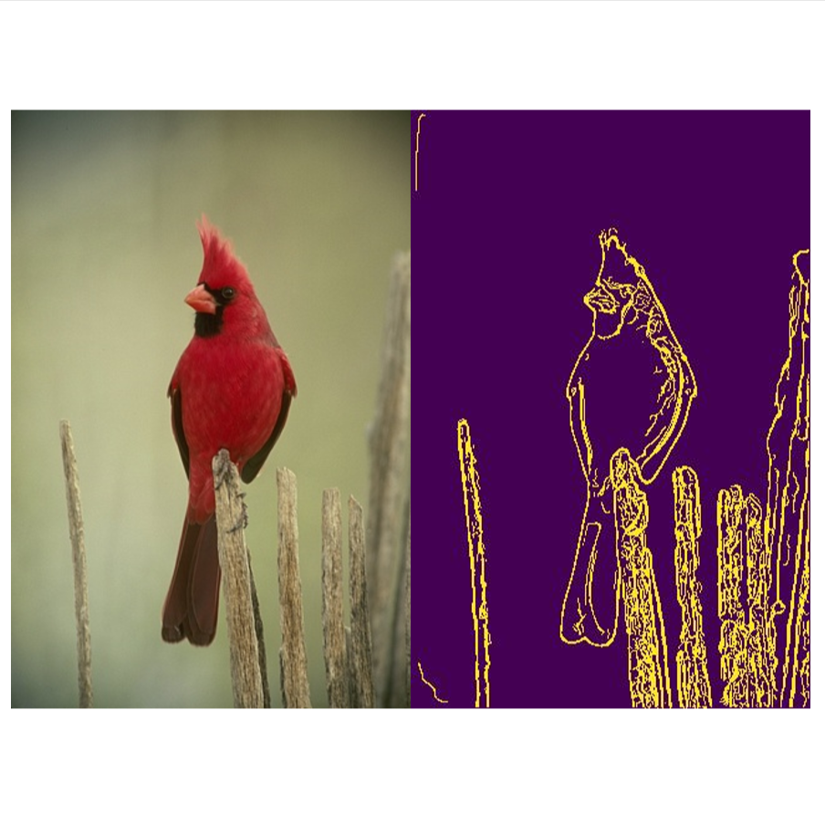
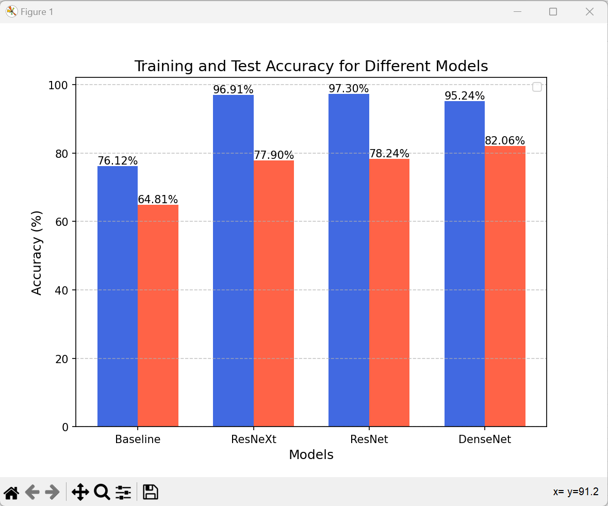

# Classical-and-Deep-Learning-Edge-Detection
This Project presents a two github repositories focusing on boundary detection and neural network architecture evaluation.  

First repository :
<a href="https://github.com/shambhurajmane/Pb-Lite-Edge-detection.git" target="_blank">Pb-Lite-Edge-detection</a>

The objective is to develop a pb (probability of boundary) algorithm for efficient boundary detection in images.   
  |  
--- | ---

Second repository : 
<a href="https://github.com/shambhurajmane/Deep-Learning-CIFAR10-pytorch.git" target="_blank">Deep-Learning-CIFAR10-pytorch</a> 
The objective is to implement multiple neural network architectures for analysis on various criteria on CIFAR10 dataset. 

